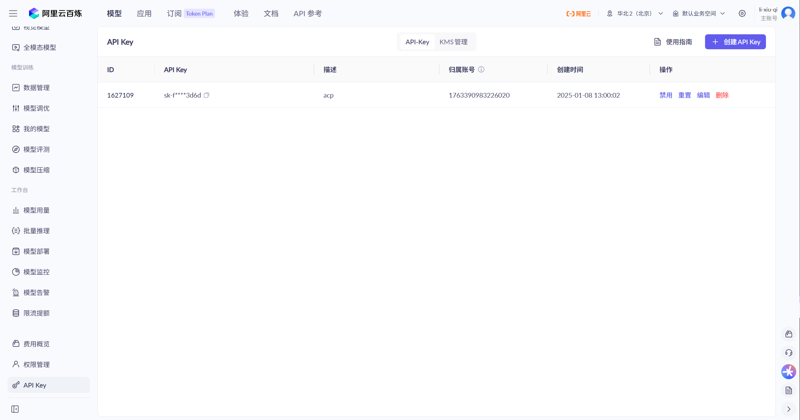
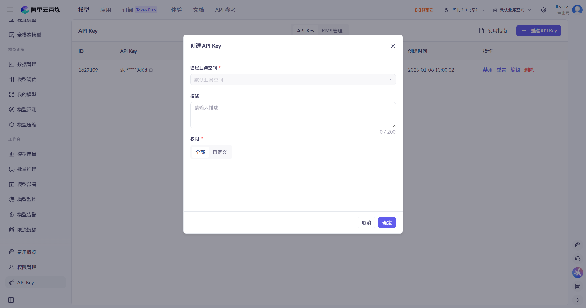
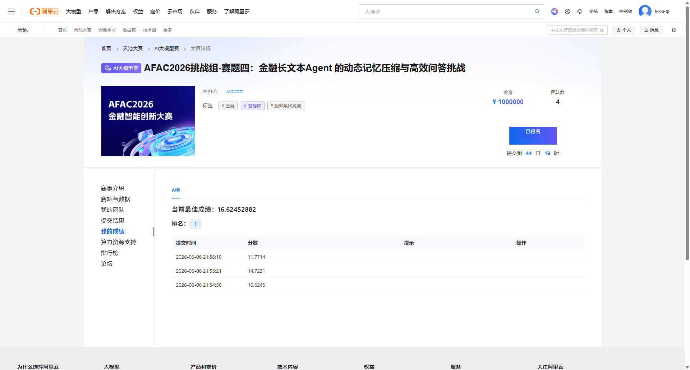

# AFAC2026 赛道四：金融长文本 Agent 的动态记忆压缩与高效问答

## 赛题简介

AFAC2026 赛道四，聚焦金融长文档问答任务。参赛者需要在**不修改基座模型参数**的前提下，设计 Agent 层面的记忆流转、动态压缩和上下文优化策略。

### 五类金融文本

| 领域 | 文档数 | A 组题数 |
|------|--------|----------|
| insurance（保险条款） | 16 | 20 |
| regulatory（监管法规） | 26 | 20 |
| financial_contracts（金融合同） | 14 | 20 |
| financial_reports（财务报表） | 10 | 20 |
| research（行业研报） | 20 | 20 |

### 题目类型

- **单选题（mcq）**：从 A/B/C/D 中选择唯一正确答案
- **多选题（multi）**：从 A/B/C/D 中选择所有正确答案，按字母顺序排列（如 ABC）
- **判断题（tf）**：A/B 表示正确/错误

### 评测指标

```
FinalScore = 100 × Accuracy × (0.7 + 0.3 × TokenScore)
TokenScore = max(0, min(1, (5,000,000 - TotalTokens) / 5,000,000))
```

准确率决定主体得分，Token 效率最多影响 30% 的加权系数。

## 快速开始

### 环境准备

```bash
python -m venv .venv
source .venv/bin/activate
pip install -r requirements.txt
```

### 配置

1. 获取 API Key（示例：阿里云百炼）

   登录 [阿里云百炼控制台](https://bailian.console.aliyun.com/) → 左侧导航栏 **API Key** → 点击右上角 **创建 API Key**

   

   填写归属业务空间（默认业务空间）、描述、权限（全部），点击确定：

   

2. 写入项目配置

   ```bash
   cp .env.example .env
   # 编辑 .env，填入 API Key
   ```

### 运行

```bash
# 运行 baseline（A 组 100 题，并发 8 线程）
cd design-draft/baselines/baseline-v0.1-no-tool
PYTHONPATH=src python -m agent.run --split A --workers 8
```

输出文件：
- `output/results_a.json` — 逐题答案与 Token 统计
- `output/submission_a.csv` — 天池提交格式

## 项目结构

```
afac2026-financial-qa/
├── config/
│   └── config.yaml              # 项目配置
├── data/
│   ├── raw_dataset/             # 原始数据集（PDF + 题目 JSON）
│   │   ├── raw/                 # 原始 PDF 文档
│   │   └── questions/           # 题目 JSON
│   └── processed_pymupdf4llm/   # PyMuPDF4LLM 解析结果
├── src/                         # 源代码
│   ├── agent/                   # Agent 主逻辑（问答、推理、记忆管理）
│   │   ├── agent.py
│   │   └── run.py               # 运行入口
│   ├── evaluation/              # 评测与提交生成
│   │   └── evaluator.py
│   ├── preprocess/              # PDF 解析、文本提取
│   │   ├── prepare_data.py
│   │   └── pdf_to_md.py
│   └── utils/                   # 工具函数
│       ├── helpers.py           # Token 统计、答案校验、配置加载
│       └── llm_client.py        # LLM 客户端封装
├── design-draft/                # 实验草稿（gitignore）
│   ├── baselines/               # 各版本 baseline（自包含）
│   ├── data/                    # 实验数据（PaddleOCR 解析等）
│   └── self-truth-baseline/     # 自建答案库
├── scripts/
│   └── test_api.py              # API 连通性测试
├── docs/                        # 文档
│   ├── 赛题与数据.md
│   └── 赛事介绍.md
├── output/                      # 运行结果（gitignore）
├── requirements.txt
├── .env.example
├── .gitignore
├── AGENTS.md
└── README.md
```

## 当前 Baseline 策略

**盲截断基线**：题目直接提供 `doc_ids`，按 id 读取解析后的文档，每篇截断到前 4000 字符，拼接为 prompt 上下文，单轮 LLM 调用输出答案。



- LLM：step-router-v1（主）+ step-3.7-flash（回退）
- 旧的前期测试最高分是16分左右，后面重复实验（没有任何调整，仅仅更换模型）发现当前baseline最佳得分可以达到：21.81（mineru 解析）/ 20.53（PyMuPDF4LLM 解析）,
- 详见 `design-draft/self-truth-baseline/archive/`

## 关键约束

- 不得修改基座模型参数
- 不得使用其他开源或闭源模型替代官方指定模型
- Token 预算：5,000,000

## 参考链接

- [赛题页面](https://tianchi.aliyun.com/competition/entrance/532486/information)