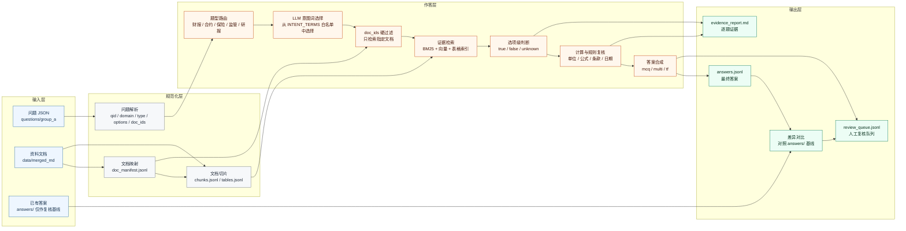

# 金融 QA 数据集技术方案

## 1. 背景与目标

本方案面向 `afac2026-financial-qa` 原始数据集，目标是基于已转 Markdown 的金融资料，对 `questions/group_a` 中的选择题、判断题和多选题进行批量作答，并输出可追溯、可复核、可提交的答案结果。

当前问题集包含 5 个领域：

| 领域 | 问题文件 | 题量 | 资料类型 |
| --- | --- | ---: | --- |
| 财报 | `financial_reports_questions.json` | 20 | 年度报告 Markdown |
| 金融合约 | `financial_contracts_questions.json` | 20 | 募集说明书/合约 Markdown |
| 保险 | `insurance_questions.json` | 20 | 保险条款 Markdown |
| 监管 | `regulatory_questions.json` | 20 | 法规 TXT/HTML/附件 Markdown |
| 研报 | `research_questions.json` | 20 | 行业/公司研究报告 Markdown |

题目字段包括 `qid`、`domain`、`question`、`options`、`answer_format`、`type`、`doc_ids`。其中 `doc_ids` 是最关键的约束信息，表示每道题只应基于指定资料作答。

方案目标：

1. 利用题目给定的 `doc_ids` 精准限定证据范围。
2. 对每个选项独立检索、判断和复核，避免只凭整体印象作答。
3. 对财务、保险、研报中的数值问题执行显式计算。
4. 输出标准答案、证据片段、来源文档、置信度和人工复核标记。
5. 支持后续替换模型、调整检索策略和扩展题量。

## 2. 总体架构

系统采用“文档规范化 + 受限检索 + 选项级判定 + 规则复核”的流水线。



推荐技术路线：

- 文档格式：以 `data/merged_md` 为主输入，其中财报、合约、保险、研报和监管附件为 Markdown，监管正文保留 HTML/TXT 并在预处理阶段转为统一纯文本结构。
- 检索方式：BM25 关键词检索 + 向量检索融合；可选增加 LLM 意图词选择器，从预定义 `INTENT_TERMS` 白名单中选择检索增强词。
- 生成方式：LLM 只负责白名单意图词选择、基于证据判断和答案合成，不直接凭常识作答。
- 数值计算：使用独立计算逻辑，LLM 只解释计算过程。
- 证据约束：任何答案必须来自题目 `doc_ids` 指定的资料。

## 3. 数据目录设计

已转 Markdown 和配套问题、答案文件位于：

```text
E:\Project\github\private\afac2026-financial-qa\data\merged_md
```

该目录作为方案的主数据根目录。原始 PDF 目录 `data/raw_dataset/raw` 只作为回溯来源，不参与常规检索和作答流程。

```text
data/merged_md/
  questions/
    group_a/
      financial_reports_questions.json
      financial_contracts_questions.json
      insurance_questions.json
      regulatory_questions.json
      research_questions.json

  financial_reports/
    annual_byd_2024_report.md
    annual_byd_2025_report.md
    annual_catl_2024_report.md
    annual_catl_2025_report.md
    ...

  financial_contracts/
    text01.md
    text02.md
    ...

  insurance/
    1.md
    2.md
    ...

  regulatory/
    txt/
      strict_v3_008_....txt
      strict_v3_009_....txt
      ...
    html/
      csrc_0001.html
      csrc_0002.html
      ...
    attachments/
      csrc_0001_att1.md
      csrc_0001_att2.md
      ...

  research/
    pack2_text01.md
    pack2_text02.md
    ...

  answers/
    group_a_answers.json
    group_a_review_flags.json
    group_a/
      fin_a_001.json
      reg_a_001.json
      ...

  processed/
    doc_manifest.jsonl
    chunks.jsonl
    tables.jsonl
    index/

  outputs/
    answers.jsonl
    evidence_report.md
    review_queue.jsonl
```

多数 Markdown 文件名可直接匹配 `doc_ids`。监管资料需要额外处理三类来源：`txt` 法规文本、`html` 监管正文、`attachments` 附件 Markdown。建议先生成 `doc_manifest.jsonl`，把所有 `doc_ids` 显式映射到文件路径：

```json
{"domain":"financial_reports","doc_id":"annual_byd_2024_report","path":"financial_reports/annual_byd_2024_report.md","title":"比亚迪2024年年度报告"}
{"domain":"financial_contracts","doc_id":"text01","path":"financial_contracts/text01.md","title":"债券募集说明书 text01"}
{"domain":"insurance","doc_id":"1","path":"insurance/1.md","title":"保险条款 1"}
{"domain":"research","doc_id":"pack2_text01","path":"research/pack2_text01.md","title":"研究报告 pack2_text01"}
{"domain":"regulatory","doc_id":"csrc_0001","path":"regulatory/html/csrc_0001.html","title":"证监会监管正文 csrc_0001"}
{"domain":"regulatory","doc_id":"csrc_0001_att1","path":"regulatory/attachments/csrc_0001_att1.md","title":"证监会附件 csrc_0001_att1"}
{"domain":"regulatory","doc_id":"strict_v3_017_中华人民共和国反洗钱法","path":"regulatory/txt/strict_v3_017_中华人民共和国反洗钱法.txt","title":"中华人民共和国反洗钱法"}
```

`answers/` 目录中的现有答案可以作为基线或复核参考，但不应直接作为模型作答输入。正式流程应先基于资料独立生成答案，再和 `answers/group_a_answers.json` 及逐题 JSON 做差异对比，定位低置信度或冲突题。

## 4. 文档预处理

### 4.1 Markdown 轻量校验

首版暂不做 Markdown 清洗，不改写正文、不删除内容、不重排表格，直接基于 `data/merged_md` 中的现有文件进行切片和索引。该阶段只做最低限度的可用性检查：

1. 校验 `doc_ids` 是否能映射到实际文件。
2. 检查文件是否可读取、是否为空、是否存在明显编码异常。
3. 记录文件类型、路径、大小、标题或首段摘要。
4. 保留 Markdown/HTML/TXT 原始内容，切片阶段只读取，不回写。
5. 对缺失、重复、无法读取的文档写入检查报告。

复杂清洗动作后置到第二轮优化，例如页眉页脚删除、目录噪声处理、表格重排、标题层级修复和单位规范化。只有当首版检索结果暴露明确问题时，再针对失败样例做定向清洗。

### 4.2 切片策略

不同领域采用不同切片方式。

| 领域 | 切片单位 | 重点保留信息 |
| --- | --- | --- |
| 财报 | 章节 + 表格 + 指标上下文 | 指标名、年度、单位、数值、页码 |
| 合约 | 条款段落 + 发行要素表 | 发行人、评级、金额、日期、违约、赎回、回售 |
| 保险 | 责任条款 + 公式 + 免责条款 | 赔付比例、等待期、免赔额、退保规则 |
| 监管 | 条/款/项 | 条文编号、义务主体、期限、施行日期 |
| 研报 | 小节 + 图表文字 | 市场规模、增速、预测年份、公司数据 |

推荐切片字段：

```json
{
  "chunk_id": "annual_byd_2025_report::p12::c03",
  "domain": "financial_reports",
  "doc_id": "annual_byd_2025_report",
  "source_path": "financial_reports/annual_byd_2025_report.md",
  "page": 12,
  "section": "主要会计数据和财务指标",
  "text": "营业收入 ...",
  "table": null
}
```

表格类切片单独保留：

```json
{
  "table_id": "annual_byd_2025_report::table_004",
  "doc_id": "annual_byd_2025_report",
  "section": "主要会计数据和财务指标",
  "columns": ["项目", "2025年", "2024年", "同比增减"],
  "rows": [
    ["营业收入", "...", "...", "..."]
  ]
}
```

## 5. 索引与检索

### 5.1 双索引

建立两套索引：

1. **文本段落索引**
   - 用于法规、合同、保险条款、研报描述。
   - 支持关键词、条款编号、实体名检索。

2. **表格指标索引**
   - 用于财报、研报、保险金额计算。
   - 支持指标名、年份、单位、公司名检索。

### 5.2 检索约束

检索必须先按 `doc_ids` 过滤：

```text
题目 qid=fin_a_001
doc_ids=["annual_byd_2024_report","annual_byd_2025_report"]

检索范围 = 仅上述两个 doc_id 的 chunks/tables
```

禁止使用未被题目指定的资料作为证据。这样可以显著降低相似文档串扰，尤其是法规和合同类题目。

### 5.3 检索融合

每个选项单独构造检索查询：

```text
问题：根据比亚迪连续两年的年度报告，下列关于公司经营业绩变化的描述中，哪些是准确的？
选项 A：2025 年营业收入较 2024 年实现增长

查询词：
- 比亚迪 2025 营业收入 2024 增长
- 营业收入 2025年 2024年
- 主要会计数据 财务指标 营业收入
```

检索策略：

1. BM25 返回关键词匹配结果。
2. 向量检索返回语义相似结果。
3. 表格索引返回指标行。
4. 合并去重后取 Top K 证据。
5. 对证据按 `doc_id`、指标命中、数字命中、章节命中重排。

### 5.4 LLM 意图词选择器

在问题转 BM25 查询的中间，可以增加一个轻量 LLM 步骤：让模型从预定义 `INTENT_TERMS` 白名单中选择与当前题目相关的检索增强词。该步骤不允许模型自由生成关键词，只能从候选词中选择，避免发散和污染检索。

流程：

```text
题目 + 选项 + domain
  -> 构造候选 INTENT_TERMS
  -> LLM 从白名单中选择 3-12 个相关词
  -> 写入 question["_intent_terms"]
  -> BM25 _build_queries() 加入 intent_terms query
```

候选词表示例：

```python
INTENT_TERMS = {
    "financial_reports": {
        "financial_compare": ["主要会计数据", "财务指标", "营业收入", "营业总收入", "净利润", "归母净利润", "归属于上市公司股东的净利润", "同比", "增长率"],
        "cashflow": ["现金流量表", "经营活动产生的现金流量净额", "经营现金流", "现金流量净额"],
        "rd": ["研发投入", "研发费用", "研发投入占营业收入比例", "研发投入金额", "研发人员"],
        "dividend": ["利润分配", "利润分配方案", "现金分红", "分红比例", "每股现金分红", "末期股息", "股东回报", "股份回购", "回购金额"],
        "scale": ["总资产", "净资产", "企业规模", "资产总额"],
    },
    "financial_contracts": {
        "issuance": ["发行人", "发行主体", "发行规模", "发行金额", "注册金额", "主体信用评级", "债项评级", "信用评级", "主承销商", "受托管理人", "中介机构"],
        "clause": ["违约责任", "违约赔偿", "赎回条款", "回售条款", "保护性条款", "债券持有人", "信息披露", "募集资金用途"],
        "convertible": ["可转换公司债券", "可转债", "转股价格", "初始转股价格", "转股价格向下修正", "有条件赎回", "有条件回售"],
        "security_info": ["股票代码", "证券代码", "股票简称", "证券简称", "发行日期", "公告日期"],
        "financial_data": ["资产负债率", "财务指标", "利润总额", "净利润", "董事及高级管理人员", "真实性"],
    },
    "insurance": {
        "claim": ["保险责任", "赔付比例", "保险金额", "身故保险金", "赔偿处理", "赔偿上限", "责任范围"],
        "waiting_period": ["等待期", "意外伤害", "非意外"],
        "surrender": ["现金价值", "退保", "退保费用", "账户价值", "保单账户价值", "已交保费", "犹豫期"],
        "medical": ["免赔额", "免赔率", "医保报销", "自费", "医疗费用", "住院", "门诊", "特定药品费用"],
        "policy_status": ["宽限期", "效力中止", "复效", "保单贷款"],
        "annuity": ["养老年金", "领取日", "开始领取日", "变更"],
        "exclusion": ["责任免除", "免责", "故意自伤", "自杀", "除外"],
        "property_auto": ["车上人员责任险", "施救费用", "特种车", "家庭财产", "水管爆裂"],
    },
    "regulatory": {
        "deadline": ["报告期限", "工作日", "自然日", "施行日期", "实施日期", "自发布之日起施行", "过渡期"],
        "aml": ["反洗钱", "客户尽职调查", "客户身份资料", "交易记录保存", "受益所有人", "高风险", "非自然人客户"],
        "payment_clearing": ["非银行支付机构", "银行卡清算机构", "收费标准", "董事", "监事", "高级管理人员", "变更报告"],
        "data_security": ["数据安全", "敏感数据", "照片", "终端设备", "统一规范管理"],
        "listed_company": ["上市公司", "公司治理", "治理准则", "章程指引", "股东大会", "股东会", "董事会", "董事候选人"],
        "disclosure_report": ["定期报告", "半年度报告", "年度报告", "信息披露", "利润分配", "现金分红"],
        "enforcement": ["行政处罚", "市场禁入", "分类监管", "分类评价", "证券公司", "审计机构", "法律责任"],
        "obligation": ["应当", "不得", "金融机构", "监管部门", "内部审批", "金额门槛"],
    },
    "research": {
        "market": ["市场规模", "行业规模", "同比", "复合增速", "复合增长率", "渗透率", "市占率", "市场份额", "预测"],
        "bank_insurance": ["银保渠道", "银行 IT", "金融信创", "ICT", "金融机构配置", "上市险企", "保险行业"],
        "technology": ["光通信", "数据中心", "半导体", "芯片", "IP 授权", "网络安全", "安全运营", "检测规则", "解析规则"],
        "consumption": ["服务消费", "居民收入", "宠物医疗", "消费趋势"],
        "brokerage_fund": ["上市券商", "客户资金杠杆", "自有资产净利率", "基金份额", "主动型", "新成立基金"],
        "ev_chemical": ["电动车", "新能源渗透率", "宁德时代", "碳酸锂", "锂电", "PE 估值", "大宗商品", "油价", "化工品"],
        "company": ["营收", "净利润", "出货量", "销量", "财务表现"],
    },
}
```

这版词表按当前 A 组 100 道题和 `data/merged_md` 文档内容调整过，重点补齐以下缺口：

- 财报：补充股东回报、每股分红、末期股息、股份回购、总资产等关键词，覆盖分红政策、回购和企业规模题。
- 合约：补充可转债、转股价格向下修正、股票/证券代码、公告日期、董事及高级管理人员真实性、资产负债率等关键词，覆盖发行要素、条款核验和财务数据一致性题。
- 保险：补充宽限期、效力中止、保单贷款、犹豫期、特定药品费用、施救费用、车上人员责任险、故意自伤/自杀等关键词，覆盖保险计算、免责、合同状态和事故责任题。
- 监管：补充上市公司治理、股东大会/股东会、董事会、定期报告、半年度报告、行政处罚、市场禁入、分类监管、数据安全等关键词，覆盖人民银行监管与证监会治理/处罚两类题。
- 研报：补充银保渠道、银行 IT、金融信创、网络安全、宠物医疗、上市券商、基金份额、电动车、碳酸锂、锂电、PE 估值等主题词，覆盖跨行业研报题。

LLM 输入只包含当前领域的候选词，输出严格 JSON：

```json
{
  "selected_terms": ["主要会计数据", "营业收入", "现金流量表", "经营活动产生的现金流量净额"]
}
```

工程接入建议：

1. `BM25Retriever` 保持纯检索逻辑，不直接调用 LLM。
2. 在 `FinancialQAAgent.answer_question()` 中、调用 `retriever.retrieve()` 之前执行意图词选择。
3. 将选择结果写入 `question["_intent_terms"]`。
4. 在 `BM25Retriever._build_queries()` 中读取 `_intent_terms` 并追加：

```python
intent_terms = question.get("_intent_terms", [])
if intent_terms:
    query_specs.append(("intent_terms", " ".join(intent_terms)))
```

建议增加缓存，按 `qid` 保存选择结果，避免重复消耗 Token。若 LLM 失败或返回空数组，则回退到现有规则检索，不阻塞主流程。

## 6. 题型路由与作答逻辑

### 6.1 题型分类

根据 `domain`、`answer_format`、`type` 路由。

| answer_format | 说明 | 输出 |
| --- | --- | --- |
| `mcq` | 单选题 | 一个选项 |
| `multi` | 多选题 | 多个选项 |
| `tf` | 判断题 | `A` 表示正确，`B` 表示错误 |

### 6.2 选项级判断

每个选项独立判断，输出中间结果：

```json
{
  "option": "A",
  "claim": "2025 年营业收入较 2024 年实现增长",
  "judgement": "true",
  "evidence": [
    {
      "doc_id": "annual_byd_2025_report",
      "page": 12,
      "text": "..."
    },
    {
      "doc_id": "annual_byd_2024_report",
      "page": 10,
      "text": "..."
    }
  ],
  "calculation": "2025营业收入 > 2024营业收入",
  "confidence": 0.91
}
```

判断标签：

- `true`：证据明确支持。
- `false`：证据明确否定。
- `unknown`：证据不足或冲突。

答案合成规则：

- `mcq`：选择置信度最高且为 `true` 的一个选项。
- `multi`：选择所有 `true` 选项；若选项证据冲突，进入复核队列。
- `tf`：陈述为 `true` 输出 `A`，陈述为 `false` 输出 `B`。

## 7. 领域专项规则

### 7.1 财报题

财报题重点是跨年度对比和指标计算。

处理规则：

1. 提取公司名、年份、指标名。
2. 优先检索“主要会计数据和财务指标”“现金流量表”“利润分配方案”“研发投入”等章节。
3. 所有比较必须有结构化数值支撑。
4. 统一单位，例如元、万元、百万元、亿元。
5. 同比、占比、现金流优劣必须显式计算。

示例：

```text
选项：2025 年研发投入占营业收入的比例较 2024 年有所下降

需要证据：
- 2025 年研发投入占营业收入比例
- 2024 年研发投入占营业收入比例

判断：
- 若 2025 比例 < 2024 比例，则 true
- 否则 false
```

### 7.2 金融合约题

合约题重点是事实核对和条款定位。

处理规则：

1. 发行人、发行规模、主体评级、债项评级、主承销商、受托管理人采用关键词精确匹配。
2. 违约、回售、赎回、转股价格、偿付安排等条款按章节检索。
3. 金额、日期、比例必须二次核验。
4. 若两份文档对比，分别抽取结构化字段后再比较。

推荐抽取字段：

```json
{
  "issuer": "...",
  "issue_amount": "...",
  "rating": "...",
  "bond_rating": "...",
  "trustee": "...",
  "lead_underwriter": "...",
  "redemption_clause": "...",
  "putback_clause": "...",
  "default_clause": "..."
}
```

### 7.3 保险题

保险题重点是责任条款和赔付计算。

处理规则：

1. 识别产品名称、事故类型、等待期、免赔额、赔付比例、保额、现金价值。
2. 计算题必须输出公式。
3. 如果多个产品比较，分别计算后排序。
4. 等待期内出险要区分意外和非意外。
5. 医疗险赔付需区分医保报销、自费金额、免赔额、赔付上限。

示例公式：

```text
可赔付金额 = min(责任范围内费用 - 免赔额, 保额上限) * 赔付比例
退保金额 = 现金价值 或 账户价值 - 退保费用
身故保险金 = max(已交保费系数, 现金价值, 基本保额/账户价值规则)
```

### 7.4 监管题

监管题重点是条文准确性。

处理规则：

1. 优先匹配法规名称、条文编号、关键词。
2. 报告期限要区分工作日、自然日、月、年。
3. 实施日期、废止日期、适用主体必须精确。
4. 判断题需要核对陈述中每个条件，全部成立才判正确。
5. 对 CSRC HTML 和附件类资料，正文与附件都要纳入 `doc_id` 映射。

### 7.5 研报题

研报题重点是行业指标、预测和跨报告对比。

处理规则：

1. 区分历史值、预测值、同比、复合增速。
2. 市场规模必须保留币种和单位。
3. 同一选项涉及多个报告时，分别取证后合并判断。
4. 研报中的图表文字和表格标题需要单独索引。
5. 对“预计”“达到”“接近”等表述保留语义差异。

## 8. LLM 提示词策略

LLM 的职责是“选择受控检索意图词、基于证据判断选项、合成答案”，不是自由问答。

意图词选择提示词：

```text
你是金融 QA 检索意图分类器。

任务：
根据题目和选项，从候选关键词中选择适合加入 BM25 检索的关键词。

要求：
1. 只能从 candidate_terms 中选择，不能创造新词。
2. 不回答题目。
3. 选择 3-12 个最相关关键词；如果没有明显相关关键词，返回空数组。
4. 优先选择能帮助定位章节、表格、条款、公式、期限、指标的词。
5. 输出严格 JSON。

输入：
domain: {domain}
question: {question}
options:
{options}
candidate_terms:
{candidate_terms}

输出：
{
  "selected_terms": ["...", "..."]
}
```

推荐系统提示词：

```text
你是金融资料选择题判定助手。你只能依据给定证据判断选项是否成立。
不得使用外部知识，不得引用未提供的资料。
如果证据不足，必须输出 unknown。
涉及数值比较时，必须列出参与比较的数值和计算过程。
输出必须为 JSON。
```

单选项判断提示词：

```text
题目：
{question}

选项：
{option_label}. {option_text}

题目答案格式：
{answer_format}

指定文档：
{doc_ids}

证据：
{retrieved_evidence}

请判断该选项是否成立。
输出 JSON：
{
  "judgement": "true|false|unknown",
  "reason": "...",
  "evidence_ids": ["..."],
  "calculation": "...",
  "confidence": 0.0
}
```

答案合成提示词：

```text
以下是每个选项的独立判断结果。
请根据 answer_format 合成最终答案。
若为 multi，选择所有 true 选项。
若为 mcq，选择唯一最可信 true 选项。
若为 tf，true 对应 A，false 对应 B。
如果证据冲突或无法唯一确定，标记 needs_review=true。
```

## 9. 输出格式

### 9.1 答案文件

`outputs/answers.jsonl`：

```json
{"qid":"fin_a_001","answer":["A","C"],"confidence":0.88,"needs_review":false}
{"qid":"reg_a_003","answer":["A"],"confidence":0.82,"needs_review":false}
```

### 9.2 证据报告

`outputs/evidence_report.md`：

```markdown
## fin_a_001

最终答案：A, C

### 选项判断

- A：成立
  - 证据：annual_byd_2025_report，第 X 页，营业收入为 ...
  - 证据：annual_byd_2024_report，第 Y 页，营业收入为 ...
  - 判断：2025 年营业收入高于 2024 年。

- B：不成立
  - 证据：...

### 复核状态

无需人工复核。
```

### 9.3 复核队列

`outputs/review_queue.jsonl`：

```json
{
  "qid": "ins_a_003",
  "reason": "多个选项文本高度相似，证据不足以区分",
  "candidate_answers": ["A","B","C"],
  "missing_evidence": ["免赔额", "复发类型"]
}
```

## 10. 质量控制

自动质检规则：

1. 答案必须来自题目指定 `doc_ids`。
2. 每个被选中的选项至少有一条强证据。
3. 数值比较题必须有计算过程。
4. 多选题必须判断所有选项，不能只找正确项。
5. 判断题必须验证陈述中的所有条件。
6. 同一题若出现证据互相矛盾，进入人工复核。
7. `confidence < 0.65` 的题进入人工复核。
8. `unknown` 选项不得进入最终答案。

人工复核重点：

- 表格转换后数字错位。
- 单位转换错误。
- PDF 转 Markdown 遗失页码或图表。
- 监管附件与正文混淆。
- 多个文档中同名指标口径不同。
- 保险条款的例外条件和免责条件。

## 11. 实施计划

### 阶段一：数据规范化

交付物：

- `doc_manifest.jsonl`
- `question_manifest.jsonl`
- Markdown 资料可读性检查报告

工作内容：

1. 读取 5 个问题 JSON。
2. 统计题型、领域、答案格式和 `doc_ids`。
3. 建立 `doc_id -> Markdown 路径` 映射。
4. 检查缺失文档、重复文档、编码异常。

### 阶段二：文档切片与索引

交付物：

- `chunks.jsonl`
- `tables.jsonl`
- 文本索引
- 表格索引

工作内容：

1. 基于 `doc_manifest.jsonl` 读取原始 Markdown/HTML/TXT。
2. 按领域切片。
3. 抽取表格和指标。
4. 建立 BM25 和向量索引。

### 阶段三：作答引擎

交付物：

- LLM 意图词选择模块
- 选项级判断模块
- 答案合成模块
- 数值计算模块

工作内容：

1. 按 `domain/type` 路由。
2. 从当前领域的 `INTENT_TERMS` 白名单中选择检索增强词，并缓存到 `qid` 级别。
3. 为每个选项生成检索查询。
4. 检索证据并重排。
5. 调用 LLM 判断选项。
6. 执行计算和规则复核。
7. 合成答案。

### 阶段四：批量运行与复核

交付物：

- `answers.jsonl`
- `evidence_report.md`
- `review_queue.jsonl`

工作内容：

1. 批量处理 100 道题。
2. 对低置信度题进行人工复核。
3. 修正 `doc_id` 映射、切片策略和提示词。
4. 冻结最终答案。

## 12. 风险与应对

| 风险 | 影响 | 应对 |
| --- | --- | --- |
| Markdown 转换丢失表格结构 | 财报、保险、研报题错误 | 表格单独抽取，保留原始行列 |
| 页码缺失 | 证据难以复核 | 使用章节标题和 chunk_id 作为备用定位 |
| `doc_ids` 与文件名不一致 | 检索不到资料 | 建立人工校验的 `doc_manifest.jsonl` |
| 多选题漏选 | 分数损失大 | 每个选项独立判断，不用整体生成 |
| 数值单位混乱 | 比较题错误 | 单位归一化，计算模块显式处理 |
| 监管正文与附件混淆 | 条文引用错误 | 正文、附件分别建 doc_id，并记录来源 |
| 证据相似但不相关 | 模型误判 | 先按 doc_id 硬过滤，再做关键词重排 |

## 13. 推荐落地标准

第一版系统不追求复杂工程化，优先保证可复核和稳定性：

1. 先完成 `doc_id` 映射、轻量校验和切片，首版不做 Markdown 清洗。
2. 先用 BM25 + 关键词规则跑通，再打开 LLM 意图词选择器做对照实验。
3. 对财报、保险、研报数值题增加计算模块。
4. 每题输出证据报告，方便人工快速纠错。
5. 在 100 题上迭代检索和提示词，稳定后再扩展。

最终判断标准：

- 每道题都有最终答案。
- 每个选中选项都有证据。
- 数值题有计算过程。
- 低置信度和冲突题进入复核队列。
- 输出格式可直接用于提交或后续评测。
