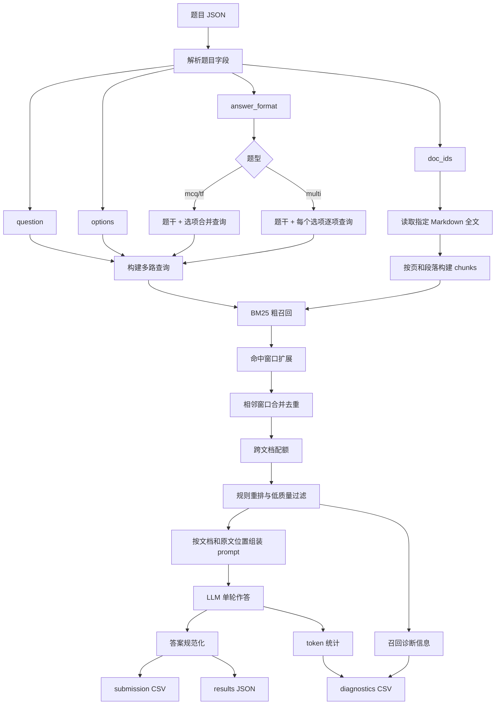
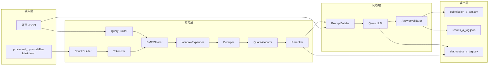
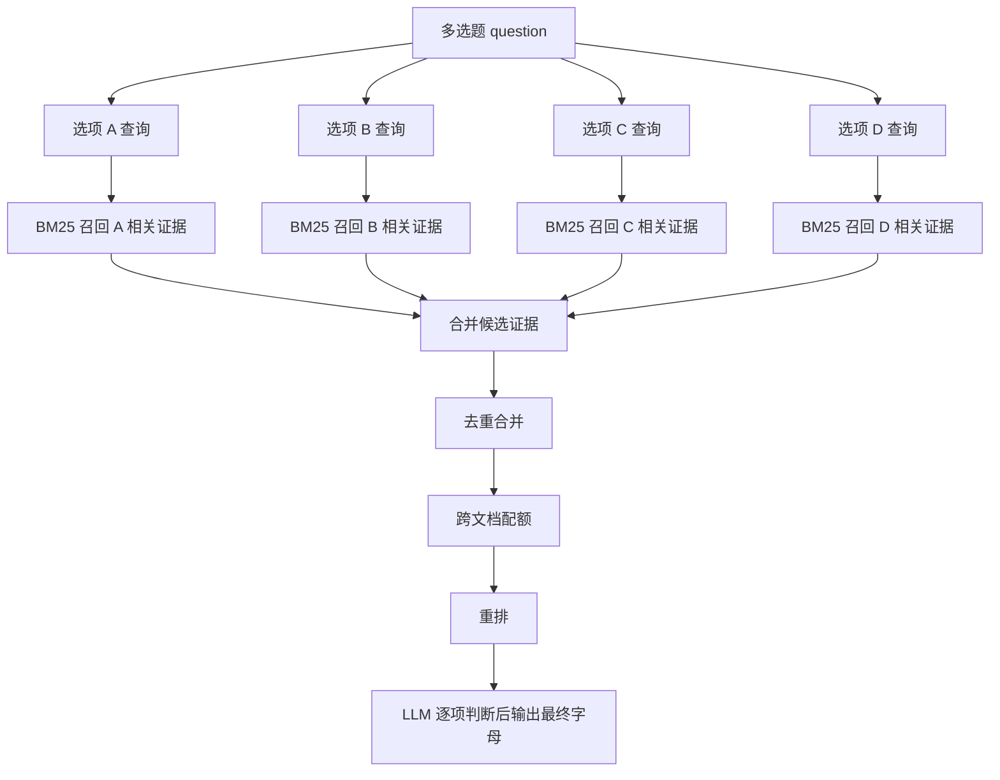
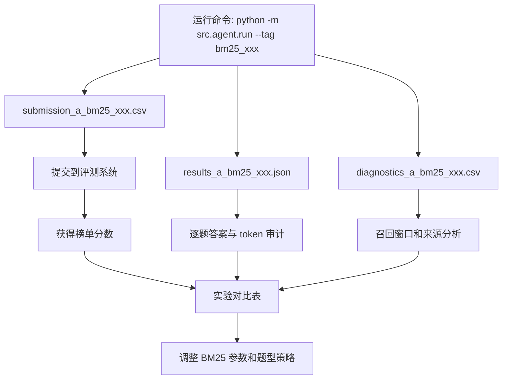

# BM25 全文检索与滚动窗口召回设计方案

## 1. 背景

当前 baseline 采用“读取 doc_ids 指定文档 + 截断前 N 字符 + 单轮 LLM”的方式答题。这个方案能跑通端到端流程，但在长文档场景下有明显短板：答案可能位于文档中后段，固定前缀截断会直接丢失关键信息。

已实现的第一版优化是“全文关键词检索 + 滚动窗口召回”。它不再只取文档开头，而是从题干和选项抽关键词，在全文滚动窗口上打分，选取高分窗口送入 prompt。该方案简单、无依赖、可快速验证，但本质仍是人工词频打分，没有 IDF、长度归一化和更可靠的排序机制。

下一步建议升级为 BM25 粗召回，并配套窗口扩展、去重合并、跨文档配额、多选题逐项检索和诊断日志。

## 2. 目标

核心目标：

- 提高答案所在片段的召回率，减少“没看到答案就猜”的情况。
- 在 500 万 Token 预算内提升准确率，优先服务多选题、跨文档比较题、财报/合同/保险条款类题目。
- 保留完整诊断信息，方便提交后根据得分变化做实验对比。

非目标：

- 暂不引入向量库。
- 暂不依赖外部 reranker API。
- 暂不重构整体 Agent 框架。
- 暂不全量开启 CoT，避免 completion token 暴涨。

## 3. 总体流程



模块边界：



## 4. BM25 召回层

### 4.1 切片策略

建议以“页 + 段落”为基础构建 chunk，而不是纯固定长度切片。

基础策略：

- 读取 `data/processed_pymupdf4llm/{domain}/{doc_id}/page_*.md`。
- 每个 chunk 保留元信息：
  - `domain`
  - `doc_id`
  - `page`
  - `chunk_id`
  - `start_char`
  - `end_char`
  - `text`
- 对每页文本按段落合并到目标长度。
- 推荐初始参数：
  - `chunk_size_chars: 1200`
  - `chunk_overlap_chars: 250`
  - `min_chunk_chars: 200`

财报和表格密集文档可以适当增大 chunk：

- `financial_reports`: 1800-2400 字符
- `financial_contracts`: 1500-2200 字符
- `insurance`: 1200-1800 字符
- `regulatory`: 1000-1600 字符
- `research`: 1400-2200 字符

### 4.2 分词策略

BM25 依赖分词。初版可以不引入复杂 NLP，只做可控的轻量分词。

中文：

- 优先使用 `jieba`，如果依赖不可用，则回退到字符 n-gram。
- 保留 2-6 字中文短语作为补充，解决金融实体和条款名被切碎的问题。

英文/数字：

- 用正则提取英文、数字、年份、金额、百分比、编号。
- 示例：
  - `2024`
  - `2025`
  - `10%`
  - `100,000`
  - `第十二条`
  - `3.2`

停用词：

- 过滤低区分度词，如“以下、关于、根据、正确、错误、描述、选项、判断、文档、哪些”。
- 不要过滤金融专业词，如“保险责任、责任免除、等待期、净利润、营业收入、受益所有人”。

### 4.3 查询构建

不能只用题干检索。建议构建多路查询：

1. 题干查询
   - 用完整 question 分词。
   - 适合定位题目核心概念。

2. 选项查询
   - 每个选项单独构建 query。
   - 多选题尤其重要，避免只召回支持某一个选项的片段。

3. 数字/年份/指标查询
   - 从题干和选项中抽取数字、年份、百分比、金额、财务指标名。
   - 这些词在金融问答中通常区分度高。

4. 领域增强查询
   - 保险：等待期、免赔额、保险责任、责任免除、现金价值、退保费用。
   - 财报：营业收入、净利润、归母净利润、经营现金流、研发投入、毛利率。
   - 合同：发行人、发行规模、票面利率、担保、评级、承销商、募集资金用途。
   - 法规：第几条、应当、不得、客户尽职调查、受益所有人、保存期限。
   - 研报：行业规模、同比、渗透率、市场份额、产量、销量。

领域增强词不能盲目加入，应只在题干或选项出现相近概念时补充。

## 5. 召回后处理

BM25 只负责找候选片段，不能直接把 top K 原样送给模型。需要做后处理。

### 5.1 窗口扩展

命中 chunk 后，向前和向后扩展上下文。

推荐参数：

- `expand_before_chars: 800`
- `expand_after_chars: 1200`
- 财报/表格题可扩展到 2000。

扩展原则：

- 尽量扩展到段落边界。
- 保留页码和标题。
- 不在表格中间截断。
- 若命中位置附近有标题，标题应一起保留。

### 5.2 去重合并

BM25 top K 经常召回相邻片段。需要合并同一文档中距离较近或重叠的窗口。

合并规则：

- 同一 `doc_id`。
- 窗口重叠，或间距小于 `merge_gap_chars`。
- 推荐 `merge_gap_chars: 500`。
- 合并后重新计算字符长度和覆盖范围。

目的：

- 减少重复内容。
- 保持条款、公式、例外条件的连续性。
- 节省 prompt token。

### 5.3 低质量过滤

需要过滤或降权的内容：

- 目录页。
- 页眉页脚。
- 免责声明。
- 重复标题。
- 全是乱码的片段。
- 只有泛词命中、没有实体/数字/专业词命中的片段。

可用规则：

- 若片段中有效中文字符比例过低，过滤。
- 若片段重复行占比过高，过滤。
- 若 BM25 分数低于动态阈值，过滤。
- 若只命中停用词或泛词，降权。

### 5.4 跨文档配额

题目给出的 `doc_ids` 通常意味着需要跨文档比较。不能让某一篇文档占满 top K。

建议策略：

- 每篇文档至少保留 `per_doc_min: 1` 个窗口。
- 每篇文档最多保留 `per_doc_max: 3` 个窗口。
- 全局最多保留 `global_top_k: 8-12` 个窗口。
- 如果题目引用 4 篇文档，优先保证 4 篇文档都有内容。

这对保险条款和跨年财报比较尤其重要。

### 5.5 重排

BM25 后可以做轻量规则重排。

加权因素：

- 命中选项专有词。
- 命中数字、年份、金额、百分比。
- 命中章节标题，如“保险责任”“责任免除”“主要会计数据”“募集资金用途”。
- 命中题目中的核心实体。
- 片段来自正文而不是目录。

降权因素：

- 目录/索引/页眉页脚。
- 内容过短。
- 重复内容。
- 只命中泛词。

## 6. 题型策略

### 6.1 单选题 mcq

策略：

- 题干查询 + 四个选项合并查询。
- 每篇文档 1-2 个窗口。
- Prompt 控制较短。

推荐召回：

- `global_top_k: 6`
- `per_doc_max: 2`

### 6.2 判断题 tf

策略：

- 重点召回能直接支持或反驳题干陈述的片段。
- 如果题干中有“均、都、全部、不得、应当”等强逻辑词，需覆盖所有相关文档。

推荐召回：

- `global_top_k: 6`
- `per_doc_max: 2`

### 6.3 多选题 multi

多选题是重灾区，建议逐项检索。

流程：



Prompt 可要求：

- 对每个选项独立判断。
- 最终只输出字母。
- 不确定时不要因为选项顺序默认选择 A。

推荐召回：

- `global_top_k: 10-12`
- `per_doc_max: 3`
- 对跨 4 文档题，确保每篇至少 1 个窗口。

## 7. Prompt 组装

召回片段应按文档和原文位置排序，而不是按 BM25 分数乱序拼接。

建议格式：

```text
【文档 text01】
[页码 3 | 位置 1200-2600 | score=12.35]
...

[页码 5 | 位置 4200-6100 | score=9.80]
...

【文档 text02】
[页码 2 | 位置 900-2300 | score=10.20]
...

问题：
...

选项：
A. ...
B. ...
C. ...
D. ...

要求：
1. 只依据上方片段作答。
2. 如果是多选题，对每个选项独立判断。
3. 最终只输出答案字母，不要解释。
4. 多选答案按字母顺序排列。

答案：
```

注意：

- 不建议把 BM25 关键词列表放入 prompt，浪费 token。
- 可以保留来源、页码、位置、score，方便模型和日志定位。
- 对模型输出仍然只要求字母，降低 completion token。

## 8. 诊断日志设计

每次实验必须可复盘。建议保留三类文件：

1. `submission_a_{tag}.csv`
   - 赛题提交格式。

2. `results_a_{tag}.json`
   - 每题完整结果。
   - 包含答案、token、召回元信息。

3. `diagnostics_a_{tag}.csv`
   - 便于人工对比和表格分析。

运行产物关系：



诊断字段建议：

- `qid`
- `domain`
- `answer_format`
- `doc_ids`
- `answer`
- `prompt_tokens`
- `completion_tokens`
- `total_tokens`
- `retrieval_method`
- `query_count`
- `chunk_count`
- `candidate_count`
- `selected_windows`
- `selected_chars`
- `doc_coverage`
- `max_bm25_score`
- `avg_bm25_score`
- `selected_sources`
- `retries`
- `error`

其中 `selected_sources` 可保存 JSON：

```json
[
  {
    "doc_id": "text01",
    "page": 3,
    "start": 1200,
    "end": 2600,
    "score": 12.35,
    "query_type": "option_A"
  }
]
```

## 9. 配置建议

建议在 `config/config.yaml` 中新增或调整：

```yaml
retrieval:
  enabled: true
  method: "bm25"

  tokenizer: "jieba"
  fallback_tokenizer: "char_ngram"

  chunk_size_chars:
    default: 1400
    insurance: 1600
    regulatory: 1200
    financial_contracts: 1800
    financial_reports: 2200
    research: 1800

  chunk_overlap_chars: 250
  min_chunk_chars: 200

  expand_before_chars: 800
  expand_after_chars: 1200
  merge_gap_chars: 500

  global_top_k:
    mcq: 6
    tf: 6
    multi: 10

  per_doc_min: 1
  per_doc_max:
    mcq: 2
    tf: 2
    multi: 3

  max_total_chars:
    mcq: 24000
    tf: 24000
    multi: 45000

  min_score: 0.1
  filter_low_quality: true
```

## 10. 实施计划

### 阶段 1：本地 BM25 替换当前关键词打分

目标：

- 不改变 LLM 调用逻辑。
- 只替换召回排序。

任务：

- 增加 `BM25Retriever`。
- 实现轻量分词。
- 构建 chunk。
- 对每个题目在 doc_ids 范围内召回 top chunks。
- 保留当前 `--tag` 和 diagnostics 输出。

验收：

- `python -m compileall src` 通过。
- `--limit 5` 可跑通。
- diagnostics 能看到 BM25 分数和来源。

### 阶段 2：窗口扩展、去重合并、跨文档配额

目标：

- 提升召回片段连续性。
- 控制 prompt 冗余。

任务：

- 命中 chunk 前后扩展。
- 合并重叠窗口。
- 每篇文档保底召回。
- 按题型限制总字符数。

验收：

- 平均 token 不超过 15000/题。
- 每题 selected windows 有稳定来源。
- 多文档题的 doc coverage 明显提升。

### 阶段 3：多选题逐项检索

目标：

- 降低多选题漏选率。

任务：

- 对 multi 题按 A/B/C/D 分别检索。
- 合并四组选项证据。
- diagnostics 记录 `query_type`。

验收：

- 多选题单字母答案比例下降。
- 总 token 仍低于 500 万预算。

### 阶段 4：提交对比与参数调优

目标：

- 用实际榜单分数判断收益。

任务：

- 使用不同 tag 跑多组参数。
- 对比答案变化、token、提交分数。
- 分析高风险题型和领域。

建议实验：

- `bm25_k6`: 保守召回。
- `bm25_k10`: 标准召回。
- `bm25_multi_option`: 多选逐项检索。
- `bm25_contract_finance_long`: 财报/合同增加窗口。

## 11. 风险与应对

风险 1：BM25 被题目泛词带偏。

应对：

- 停用词过滤。
- 选项专有词加权。
- 数字/年份/指标加权。

风险 2：切片破坏表格或条款连续性。

应对：

- 命中后窗口扩展。
- 按段落/页边界截断。
- 合并相邻窗口。

风险 3：跨文档比较题漏掉某篇文档。

应对：

- 每篇文档设置最低召回配额。
- 按 doc_id 分组后再全局排序。

风险 4：Token 消耗过高。

应对：

- 按题型设置 `max_total_chars`。
- 多选题多给，mcq/tf 少给。
- 去重合并。

风险 5：多选题过选。

应对：

- 引入逐项判断。
- 后续可增加二次自检，但不在第一阶段全量启用。

## 12. 推荐下一步

优先实现阶段 1 和阶段 2：

```text
BM25 粗召回
+ 命中窗口扩展
+ 相邻窗口合并去重
+ 跨文档配额
+ 诊断日志
```

如果提交分数有提升，再继续做阶段 3 的多选题逐项检索。这样每一步都有可对比的提交文件和诊断文件，避免一次性引入太多变量后无法判断哪个模块有效。
